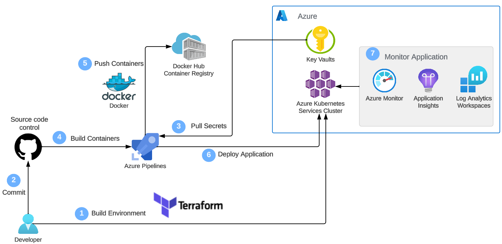
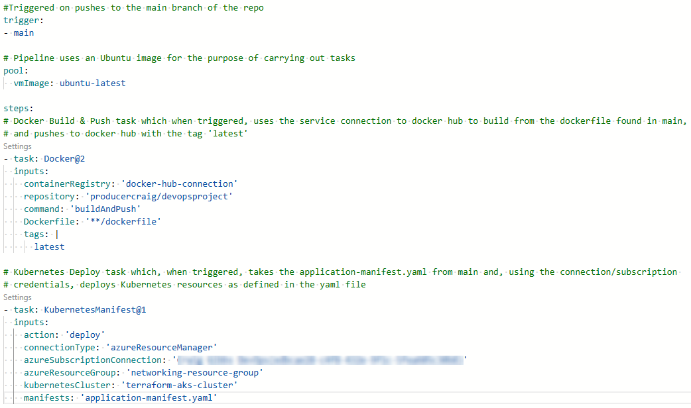
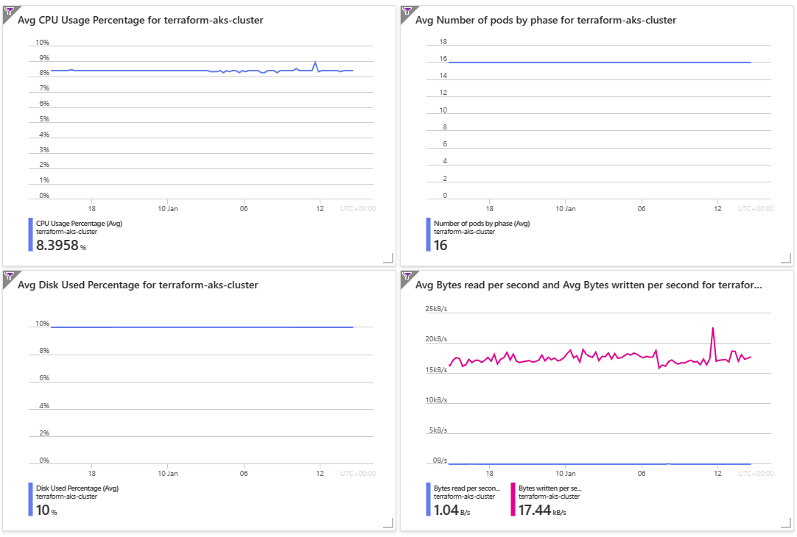

# Web-App-DevOps-Project

Welcome to the Web App DevOps Project repo! This application allows you to efficiently manage and track orders for a potential business. It provides an intuitive user interface for viewing existing orders and adding new ones.

## Table of Contents

- [Project Structure](#project-structure-uml)
- [Features](#features)
- [Getting Started](#getting-started)
- [Technology Stack](#technology-stack)
- [Infrastructure](#infrastructure)
- [Deployment](#deployment)
- [Testing](#testing--distribution)
- [CI/CD Pipeline](#cicd-pipeline)
- [Monitoring](#monitoring)
- [Contributors](#contributors)
- [License](#license)

## Project Structure (UML)

## Features

- **Order List:** View a comprehensive list of orders including details like date UUID, user ID, card number, store code, product code, product quantity, order date, and shipping date.
  

- **Pagination:** Easily navigate through multiple pages of orders using the built-in pagination feature.
  

- **Add New Order:** Fill out a user-friendly form to add new orders to the system with necessary information.
  

- **Data Validation:** Ensure data accuracy and completeness with required fields, date restrictions, and card number validation.

## Getting Started

### Prerequisites

For the application to succesfully run, you need to install the following packages, in addition to a valid Azure subscription:

- flask (version 2.2.2)
- pyodbc (version 4.0.39)
- SQLAlchemy (version 2.0.21)
- werkzeug (version 2.2.3)
- azure-identity (version 1.15.0)
- azure-keyvault-secrets (version 4.7.0)
- chardet (version 4.0.0)

### Usage

To run the application, you simply need to run the `app.py` script in this repository. Once the application starts you should be able to access it locally at `http://127.0.0.1:5000`. Here you will be meet with the following two pages:

1. **Order List Page:** Navigate to the "Order List" page to view all existing orders. Use the pagination controls to navigate between pages.

2. **Add New Order Page:** Click on the "Add New Order" tab to access the order form. Complete all required fields and ensure that your entries meet the specified criteria.

## Technology Stack

- **Backend:** Flask is used to build the backend of the application, handling routing, data processing, and interactions with the database.

- **Frontend:** The user interface is designed using HTML, CSS, and JavaScript to ensure a smooth and intuitive user experience.

- **Database:** The application employs an Azure SQL Database as its database system to store order-related data.

## Infrastructure

- **Docker:** Included is a dockerfile which can be used to build and run a containerized version of the app.
    - ***dockerfile***
        - **Base Image Selection**: The Dockerfile begins with **FROM python:3.8-slim** which uses an official Python runtime as the base image. This is a lightweight version of Python 3.8.
        - **Setting the Working Directory**: **WORKDIR /app** sets the working directory to /app inside the container. This is where the application files will reside.
        - **Copying Application Files**: **COPY . /app** copies the application files from the current directory into the /app directory inside the container.
        - **Exposing Ports**: **EXPOSE 5000** makes port 5000 available to the host and other containers.
        
    - ***Docker Commands used***
        - **docker build -t devopsproject:latest .** builds a Docker image from the Dockerfile in the current directory, tagging it as devopsproject:latest.
        - **docker run -d -p 5000:5000 myapp:latest** runs a container in detached mode, mapping port 5000 of the host to port 5000 in the container, using the devopsproject:latest image. Detached mode allows the container to run in the background.
        - **docker push producercraig/devopsproject:latest** pushes the tagged image to Docker Hub.
        - **docker pull producercraig/devopsproject:latest** pulls the image. The container can then be run using the run command as detailed above.

- **Terraform Modules:** Included is a terraform module enabling the setup of infrastructure upon which the app can be run. Please see information on the modules below:

    1. **Root Module**
        - ***Accessing the AKS cluster***
            - To enable **kubectl** access to the AKS cluster, **cluster_kubeconfig** is defined as an output in the root module (referencing the **aks_kubeconfig** output in **aks-cluster-module** outputs) to enable access to the **kubeconfig** file.
        - ***Resources***
            - **Provider: Azurerm**: The resource provider defined in main.tf. Running version *3.0.0*.
            - **Module integration**: The *networking-module* and *aks-cluster-module* are both referenced here, with input values declared for both.
            - **Credentials**: All credentials/secrets are declared as input variables in **variables.tf** and stored in a private file.
    2. **Networking Module**
        - ***Input Variables***
            - **resource_group_name**: The name of the Azure Resource Group. *Default: devopsproject-aks*
            - **location**: The location of the Azure resource. *Default: UK South*
            - **vnet_address_space**: The address space for the virtual network. *Default: 10.0.0.0/16*

        - ***Output Variables***
            - **vnet_id**: ID of the Virtual Network (VNet). Used within the cluster module to connect the cluster to the defined VNet.)
            - **control_plane_subnet_id**: ID of the control plane subnet. Used to specify the subnet where the control plane components of the AKS cluster will be deployed to.
            - **worker_node_subnet_id**: ID of the worker node subnet.  Used to specify the subnet where the worker nodes of the AKS cluster will be deployed to.
            - **networking_resource_group_name**: Name of the Azure Resource Group for networking resources. Used to ensure the cluster module resources are provisioned within the same resource group.
            - **aks_nsg_id**: ID of the Network Security Group (NSG) for AKS. Used to associate the NSG with the AKS cluster for security rule enforcement and traffic filtering.

    3. **AKS Cluster Module**
        - ***Input Variables***
            - **aks_cluster_name**: variable that represents the name of the AKS cluster being created.
            - **cluster_location**: variable that specifies the Azure region where the AKS cluster will be deployed to.
            - **dns_prefix**: variable that defines the DNS prefix of the cluster.
            - **kubernetes_version**: variable that specifies which Kubernetes version the cluster will use.
            - **service_principal_client_id**: variable that provides the Client ID for the service principal associated with the cluster.
            - **service_principal_secret**: variable that supplies the Client Secret for the service principal.
        - ***Output Variables***
            - **resource_group_name** (From the Networking Module)
            - **vnet_id** (From the Networking Module)
            - **control_plane_subnet_id** (From the Networking Module)
            - **worker_node_subnet_id** (From the Networking Module)

## Deployment

- **Kubernetes**
    - ***Deployment Manifest***: The deployment manifest (top section of **application-manifest.yaml**) declares a Kubernetes deployment named *flask-app-deployment*. It has the following characteristics:
        - **Name**: flask-app-deployment
        - **App**: flask-app (this is the name assigned to the web app upon deployment for the purposes of selection/port opening via the associated service.)
        - **Update Strategy**: RollingUpdate, with a max surge of **1** and a max unavailable of **1**. This means that when rolling updates are applied, the deployment is able to create one additional replica if required, to ensure no downtime. The max unavailable of 1 should also ensure that only one pod is being updated at a time. This strategy also allows for rollbacks in the event of an update occuring which causes issues.
        - **Image**: The image for the app is hosted on dockerhub, with the name/tag of **producercraig/devopsproject:0.1**. The tag would ideally be changed to 'latest' during any external rollout to ensure that the application image is kept up-to-date.
        - **Container Port**: The port provided is 5000, which matches the port opened in the above Terraform configuration. This allows access to the web app.
    - ***Service Manifest***: The service manifest (bottom section of **application-manifest.yaml**) declares a Kubernetes service named *flask-app-service*. It has the following characteristics:
        - **Name**: flask-app-service
        - **Type**: ClusterIP - this was chosen to allow internal access of the web app while in development.
        - **Ports**: Traffic received on port 80 (via a web browser) is forwarded to the target port of 5000, as detailed above.

## Testing & Distribution

- **Functional Testing**
    - The app was tested by port forwarding port 5000 on localhost, to access the web app and ensure that all functionality was behaving as intended.
- **Load Testing**
    - As the app has been declared with 2 replicas, it would be beneficial to perform load testing to simulate traffic and ensure that the application performs well under load.
- **Validation & Monitoring**
    - It would be beneficial to implement a monitoring solution (perhaps within Azure) to track the application's performance and overall health. This would help in catching and addressing any issues.
- **Internal Access**
    - Internal access could be granted by way of RBAC to manage which users can access the application within the cluster, to further improve security and assist with testing & further development.
    - Steps involved:
        1. Configure a Kubernetes Service (like the flask-app-service defined above) to expose the application within the internal network.
        2. Use Kubernetes namespaces to isolate the application and control access as required.
- **External Access**
    - For external access, an ingress controller would be required to provide an entry point for external traffic and routing it to *flask-app-servive* as defined above. SSL certification would be a consideration here also, to enable secure HTTPS access.
    - Steps involved:
        1. Deploy an Ingress resource to expose the service externally.
        2. Configure DNS to point to the Ingress controller's external IP.
        3. Apply SSL certificate for secure HTTPS access.
    
## CI/CD Pipeline

- **Source Repository**
    - The Azure DevOps hosted repo is cloned from the github repo.
    - Hosting the repo on Azure DevOps allows for use of the CI/CD pipeline tools, as demonstrated below with the build pipeline.

- **Build Pipeline**

    

- **Testing & Validation**
    - All service connections were verified upon creation in Azure DevOps.
    - The build pipeline was initially unsuccessful due to the **parallelism** setting within Azure DevOps being set to a value of **0**. This was resolved by changing the maximum parallel tasks to a value of **1**, enabling the pipeline to run.
    - The build pipeline was then confirmed to run successfully, with the status of pods/the deployment being confirmed via use of **kubectl get pods**, and **kubectl get deployments** within the correct kubeconfig context.
    - Upon completion of the build pipeline, Docker Hub was checked to ensure that the Docker build was successfully pushed to the hub.

## Monitoring

- **Dashboard**
A dashboard was created with the metrics from the below 'Metrics Explorer' section. It can be seen here:

- **Metrics Explorer**
    - ***Average Node CPU Usage***: Measures the average CPU usage across all nodes. This metric indicates the overall CPU load and is useful in understanding how heavily the nodes are working. Higher values here would suggest increased CPU activity. Consistently high values might indicate the need for more resources.
    - ***Average Pod Count***: Represents the average number of pods running across the cluster. It gives a sense of the scale and utilisation of the Kubernetes cluster. An increasing trend could imply scaling up of services, whereas a decreasing trend might indicate scaling down or potential issues.
    - ***Used Disk Percentage***: Indicates the percentage of disk space being used. It's a key metric for understanding storage capacity. If the disk is almost full, it could lead to service disruptions. It’s important to monitor this to avoid running out of storage space.
    - ***Bytes Read and Written per Second***: Tracks the rate of data read from and written to the storage. Sudden spikes or drops could indicate change in usage.
- **Log Analytics**
    - ***Average Node CPU Usage Percentage per Minute***: Shows the minute-by-minute CPU usage percentage for each node. This could be useful for identifying short-term spikes or drops in CPU usage.
    - ***Average Node Memory Usage Percentage per Minute***: Measures how much memory is being used on each node, updated every minute. Consistently high memory usage might necessitate scaling up resources or optimising applications.
    - ***Pods Counts with Phase***: Displays the number of pods in different phases (eg, Running, Pending, Failed) within the cluster. Several pods in 'Pending' or 'Failed' states might indicate issues with resources or config errors.
    - ***Find Warning Value in Container Logs***: Searches container logs for warning messages. Regular occurrences of warnings might signal underlying issues in the application or infrastructure configuration.
    - ***Kubernetes Events***: Lists significant events in the Kubernetes cluster. This helps in tracking deployments, errors, and other important events.
- **Alerts**
    - ***Disk Used Percentage Alert***: Triggers an alert when the disk usage exceeds 80% capacity and sends an email notification. Receiving this alert means action is required to increase disk capacity.

        **Response Actions**

        1. Quickly check the current disk usage and identify the nodes or pods consuming the most space. If temporary files or logs are causing the high usage, clean them up.
        2. If the disk usage is high due to workload needs, defining a persistent volume and configuring the application-manifest.yaml to make a volume claim would be effective.
        3. Continuously monitor disk usage to ensure the problem is resolved.

    - ***Memory Working Set Percentage Alert***: Triggers an alert when the working set memory usage crosses a certain percentage. It indicates that applications or nodes might soon run out of memory, necessitating either scaling up resources or optimising memory usage.

        **Response Actions**

        1. Determine which pods or services are using excessive memory.
        2. Consider if the high memory usage is due to inefficient application code or resource-intensive tasks and optimise the app if required.
        3. Increase the memory allocation to the nodes or scale the number of nodes in the cluster. This would be handled in the aks-cluster module of terraform in this project.

## Azure Key Vault

**Azure Key Vault Setup & Permissions**

- The Azure Key Vault, named **cg-devops-key-vault**, is configured to securely store secrets for use with the app. It can also be used to set up and manage other sensitive information such as keys and certificates. 

- **Key Vault Administrator**: My own user account has been granted Key Vault Administrator privileges. This role allows for comprehensive management of the Key Vault, including configuring access policies, managing stored secrets, keys, and certificates. In this instance it was used to add the relevant secrets to the vault.

- **Key Vault Officer for AKS**: A managed identity for the AKS cluster has been assigned the role of Key Vault Officer. This role is essential for allowing the AKS cluster to access necessary secrets without exposing sensitive credentials.

- **Stored Secrets**

    The Key Vault contains secrets which are essential to the application's operation. These are:

    - **Server**: The address of the database server.
    - **Database**: The name of the specific database within the server.
    - **Username**: The username for database access.
    - **Password**: The corresponding password for database access.

    Each secret is vital for establishing a secure connection to the database. They are stored in the Key Vault to enhance security by avoiding hardcoding sensitive details within the application code.

- **Integration of AKS with Key Vault**

    To allow the AKS cluster to securely retrieve secrets from the Key Vault, several steps were taken:

    1. A managed identity was created for the AKS cluster. This identity serves as a secure way for AKS to access Azure services, including the Key Vault.

    2. The managed identity was granted the Key Vault Officer role. This ensures it has the necessary permissions to retrieve secrets from the Key Vault but not to manage the Key Vault itself.

- **Application Code Modifications for Secure Secret Retrieval**

    The application code has been modified to leverage managed identity credentials for secure secret retrieval. Key changes include:

    1. The code imports **azure.identity** and **azure.keyvault.secrets**, allowing it to interact with Azure services.

    2. **DefaultAzureCredential()** is used to authenticate the managed identity with Azure services.

    3. **SecretClient** is initialised with the Key Vault URL and the credential from the managed identity.

    4. The application code retrieves the database server, database name, username, and password from the Key Vault using **secret_client.get_secret("...").value**.

    5. These values are then used to establish a database connection, ensuring that sensitive information is not hardcoded into the application but securely pulled from the Key Vault.

## Contributors 

- [Maya Iuga]([https://github.com/maya-a-iuga](https://github.com/maya-a-iuga))
- [Craig Gibbs]([https://github.com/producercraig](https://github.com/producercraig))

## License

This project is licensed under the MIT License. For more details, refer to the [LICENSE](LICENSE) file.
